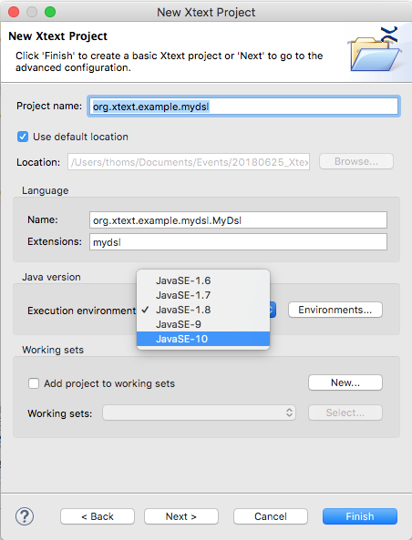
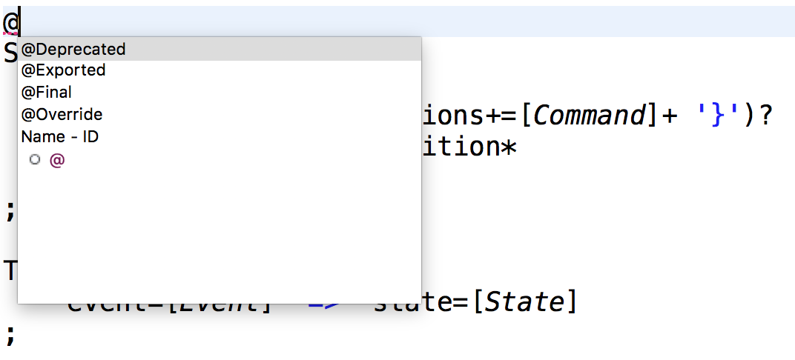
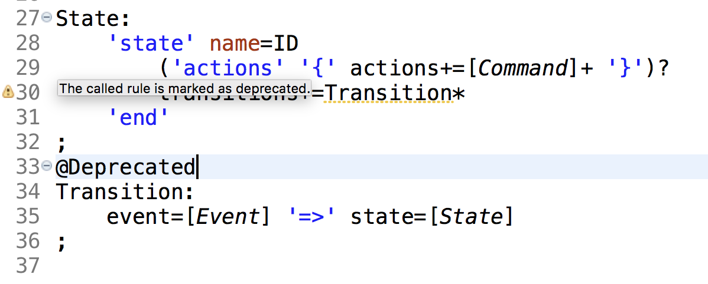
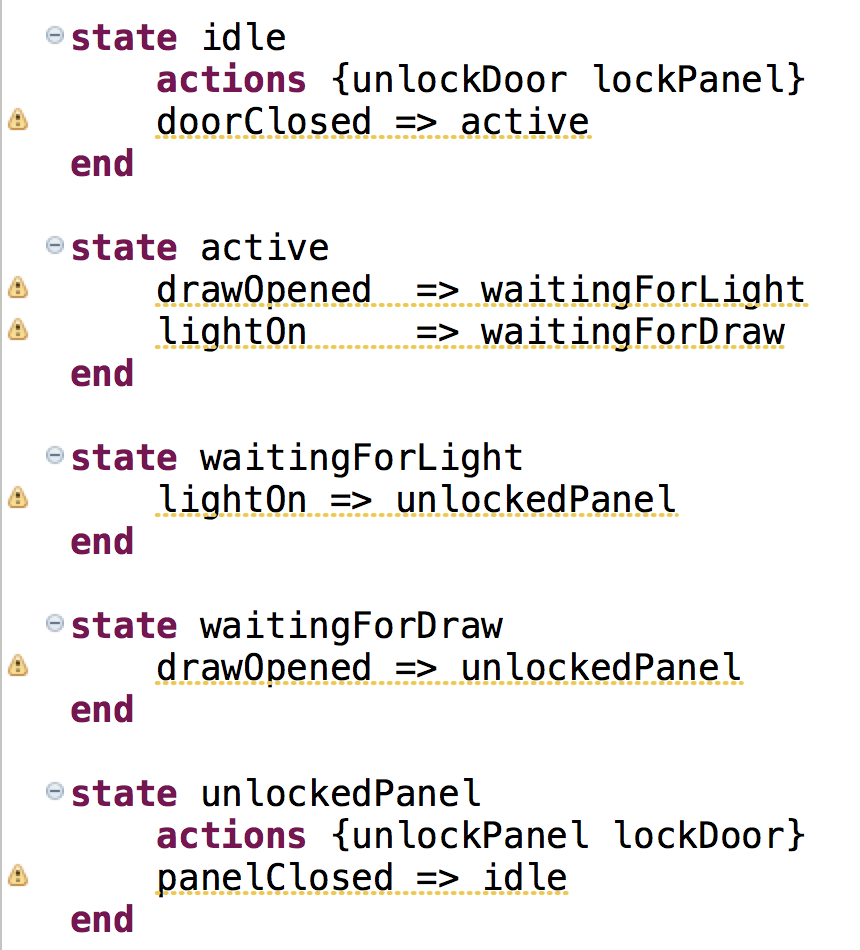
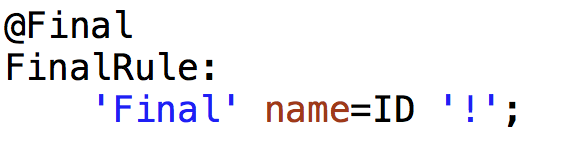
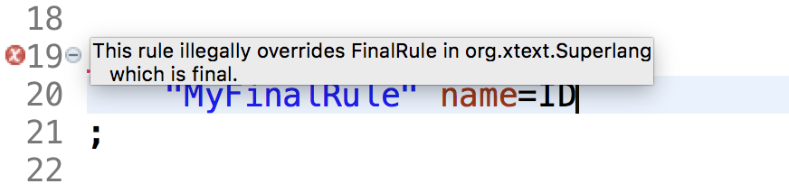

---?image=assets/image/particles-1435361_1920.jpg

# What's new in Eclipse Xtext 2.14 ?

### Virtual Eclipse Webinar Series

---

## About us

@div[left-50 cover]

 
Holger Schill
@divend

@div[right-50]

 
Karsten Thoms
@divend

@div[bottom center]

@divend

---?image=assets/image/kyle-gregory-devaras.jpg

## Agenda

- Project Organization |
- Xtext Release History |
- Xtext 2.14 N&N |
- Xtend N&N |
- Outlook |
- Open Discussion |

---
# Project Organization

+++
@title[Project Statistics]

+++
@title[New Project Lead]

## Project Lead

### Christian Dietrich

+++
@title[New Committers]

## New Committers

### Arne Deutsch

+++
@title[Contributors]

### Kudos to our
## Frequent Contributors

<table>
<tr>
<td>

 
Titouan Vervack
 
@fa[github] tivervac
</td>

<td>

 
Tamas Miklossy
 
@fa[github] miklossy
</td>
</tr>
</table>

---
## Xtext History

<iframe width="100%" height="400" src="https://time.graphics/embed?v=1&id=99959" frameborder="0" allowfullscreen></iframe>

<a style="font-size: 12px; text-decoration: none;" title="Xtext History" href="https://time.graphics/line/99959">Xtext History</a>

+++?image=assets/image/fireworks-574739_1920.jpg

# Happy 10th Anniversary !

<!--
  ****************************************************
  XTEXT 2.14
  ****************************************************
-->
---?image=assets/image/sunrise-1756274_1920.jpg

# Xtext 2.14
      

@size[0.5em](Participating in the Eclipse Photon Simultaneous Release)

<!--
  ****************************************************
  MAINTENANCE
  ****************************************************
-->

---

# Maintenance

<!--
  ****************************************************
  UPGRADE
  ****************************************************
-->
---?image=none

@div[top-20 size=auto 10%]

@divend

- Gradle |
- Maven / Eclipse Tycho |
- Target Platform Definitions |
- ObjectWeb ASM Library |
- Orbit URL |
- Node.js |
- Oomph Setup |
- LSP |

<!--
  ****************************************************
  JAVA
  ****************************************************
-->
---?image=https://upload.wikimedia.org/wikipedia/de/thumb/e/e1/Java-Logo.svg/541px-Java-Logo.svg.png&size=auto 90%

+++

+++?code=examples/mydsl_j10/org.xtext.example.mydslj10.parent/pom.xml&language=xml&title=Parent POM (Tycho)
@[10](Xtext Version)
@[12-13](Maven Compiler Settings for Java 10)
@[15-16](Tycho 1.2.0 for Java 10)
@[17-21](Overridable properties for dynamic tycho-surefire-plugin configuration)
@[218-228](Plugin management for tycho-surefire-plugin; no UI harness by default)
@[260-270](Profile 'macos'; auto-activate on macOS and adds platform specific JVM arg for tycho-surefire-plugin)
@[271-291](Profile 'jdk9-or-newer'; auto-activate on Java >=9 and configure JPMS)

+++?code=examples/mydsl_j10/org.xtext.example.mydslj10.parent/org.xtext.example.mydslj10.ui.tests/pom.xml&language=xml&title=pom.xml in UI Tests project
@[21-27](Override managed configuration of tycho-surefire-plugin)
@[25](Enable UI harness)

<!--
  ****************************************************
  JUNIT 5
  ****************************************************
-->
---?image=https://junit.org/junit5/assets/img/junit5-logo.png&position=top 50px center&size=auto 35%

JUnit 5

+++

+++

## JUnit 4 / JUnit 5

+++

## Test execution

<!--
  ****************************************************
  Grammar Annotations
  ****************************************************
-->
---

# Grammar Annotations

+++

+++

+++?code=examples/statemachine/org.eclipse.xtext.example.fowlerdsl/src/org/eclipse/xtext/example/fowlerdsl/GenerateStatemachine.mwe2&title=Generator Workflow GenerateStatemachine.mwe2
@title[@Deprecated]

## @Deprecated

@[35](Enable deprection warnings)

+++

+++
@title[@Final]

@div[left-50 cover]

@divend

@div[right-50]

@divend

+++?code=examples/statemachine/org.eclipse.xtext.example.fowlerdsl/src/org/eclipse/xtext/example/fowlerdsl/Statemachine.xtext&title=Statemachine.xtext
@title[@Exported]

@[19,24,29](`@Exported` annotation)

+++?code=examples/statemachine/org.eclipse.xtext.example.fowlerdsl/src-gen/org/eclipse/xtext/example/fowlerdsl/resource/StatemachineAbstractResourceDescriptionStrategy.java&title=StatemachineAbstractResourceDescriptionStrategy.java

<!--
  ****************************************************
  WIZARDS
  ****************************************************
-->
---

# Wizards

+++?code=examples/statemachine/org.eclipse.xtext.example.fowlerdsl/src/org/eclipse/xtext/example/fowlerdsl/GenerateStatemachine.mwe2&title=Generator Workflow Configuration
@[38-40](Enable generation of New Project Wizard) 

+++?code=examples/statemachine/org.eclipse.xtext.example.fowlerdsl.ui/src/org/eclipse/xtext/example/fowlerdsl/ui/wizard/StatemachineProjectTemplateProvider.xtend&title=StatemachineProjectTemplateProvider.xtend
@[22](Implement `IProjectTemplateProvider` interface)

+++?code=https://raw.githubusercontent.com/eclipse/xtext-eclipse/master/org.eclipse.xtext.ui/src/org/eclipse/xtext/ui/wizard/template/IProjectTemplateProvider.java

+++?code=examples/statemachine/org.eclipse.xtext.example.fowlerdsl.ui/src/org/eclipse/xtext/example/fowlerdsl/ui/wizard/StatemachineProjectTemplateProvider.xtend&title=StatemachineProjectTemplateProvider.xtend
@[23-25,30](Provide templates)
@[28-29](Active annotation `@ProjectTemplate`)
@[31-35](Create widgets)
@[37-44](Update variables on state change)
@[46-51](Validate page state and raise issues)
@[53-78](Produce content for template)
@[54](Use `PluginProjectFactory`) for project creation
@[55-56](Project name and target location)
@[57-58](Project natures & builders)
@[59](Create source folders)
@[61-59](Generate files into created project)

<!-- *** NEW FILE WIZARD *** -->
+++?code=examples/statemachine/org.eclipse.xtext.example.fowlerdsl/src/org/eclipse/xtext/example/fowlerdsl/GenerateStatemachine.mwe2&title=Generator Workflow Configuration
@[41-43](Enable generation of New File Wizard) 

<!--
  ****************************************************
  CODE MINING
  ****************************************************
-->
---?image=https://blogs.itemis.com/hs-fs/hubfs/Blog/Xtext/Code-Mining-Preview.jpg
@title[Code Mining]

+++

+++?code=examples/domainmodel/org.eclipse.xtext.example.domainmodel/src/org/eclipse/xtext/example/domainmodel/GenerateDomainmodel.mwe2&title=Generator Workflow GenerateDomainmodel.mwe2
@[12](Import the CodeMiningFragment.)
@[57-60](Configure the CodeMiningFragment.)

+++?code=examples/domainmodel/org.eclipse.xtext.example.domainmodel.ui/src/org/eclipse/xtext/example/domainmodel/ui/codemining/DomainmodelCodeMiningProvider.java&lang=Java&title=DomainmodelCodeMiningProvider.java
@[32](Inherit from <code>org.eclipse.xtext.ui.codemining.AbstractXtextCodeMiningProvider</code>)
@[39-40](Implement <code>createCodeMinings()</code>)
@[42, 45](Collect all instances of <code>Operation</code> in the resource and loop)
@[47-49](Skip operations with an explicit return type)
@[51-55](Compute the inferred return type name)
@[57-60](Code Mining should be inserted after right paranthesis - find position within the Node Model)
@[62-63](Compute the displayed mining text and create a <strong>line content code mining</strong>)

<!--
  ****************************************************
  Performance
  ****************************************************
-->
---

# Performance

<!--
  ****************************************************
  WHAT'S NEXT
  ****************************************************
-->
---?image=assets/image/board-1647323_1920.jpg

+++

- Machine Learning Formatting |
- Cloudbees Jenkins Enterprise |
- EPL 2 |
- Java 11 |
- Use Wizard APIs |

<!--
  ****************************************************
  QUESTIONS
  ****************************************************
-->
---?image=assets/image/questions-2408094_1920.jpg

<!--
  ****************************************************
  CONTACT
  ****************************************************
-->
---?image=assets/image/wallpaper-1492818_1920.jpg

 
<table>
<tr>
  <td>@fa[twitter gp-contact](@kthoms)</td>
  <td>@fa[twitter gp-contact](@holgerschill)</td>
</tr>
<tr>
  <td>@fa[envelope-square](thoms@itemis.de)</td>
  <td>@fa[envelope-square](schill@itemis.de)</td>
</tr>
</table>

<!--
  ****************************************************
  THANKS
  ****************************************************
-->
---?image=assets/image/thanks-1804597_1920.jpg

---
## Links

- Xtext 2.14 Release Notes: https://www.eclipse.org/Xtext/releasenotes.html#/releasenotes/2018/05/23/version-2-14-0
- Blog [“Xtext 2.14 adds support for JUnit 5“](https://blogs.itemis.com/en/xtext-2.14-adds-support-for-junit-5)
- Blog [“Code Mining Support in Xtext”](https://blogs.itemis.com/en/code-mining-support-in-xtext)
- Blog [“Generating a new project wizard with Xtext 2.14”](https://blogs.itemis.com/en/generating-a-new-project-wizard-with-xtext-2.14)
- Blog [“New File Wizard – easy to generate with Xtext 2.14”](https://blogs.itemis.com/en/new-file-wizard-easy-to-generate-with-xtext-2.14)
- Blog [“New Project Wizard: einfach mit Xtext 2.14 generieren” (German)](https://blogs.itemis.com/de/new-project-wizard-einfach-mit-xtext-2-14-generieren)
- Blog [“Erzeugen des New File Wizards” (German)](https://blogs.itemis.com/de/new-file-wizard-einfach-mit-xtext-2.14-generieren)
- [LSP4J Changelog](https://github.com/eclipse/lsp4j/blob/master/CHANGELOG.md) 

---
## Images

This presentation contains the following images:

<table>
<tr>
<th>URL</th>
<th>Name</th>
<th>License</th>
</tr>

<tr>
  <td>https://de.wikipedia.org/wiki/Datei:Java-Logo.svg</td>
  <td>Java Logo</td>
  <td>Public Domain</td>
  <!--
  <td><a href="https://creativecommons.org/licenses/by/2.0/">CC BY 2.0</a></td>
  -->
</table>

